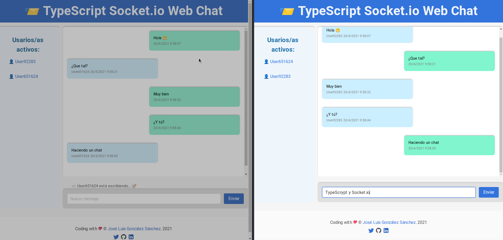

# TypeScript/JavaScript Chat con Socket.io
Ejemplo de chat usando la librería Socket.io de Node.js, con el objetivo de manejar websocket y crear un chat en tiempo real.

[](https://www.typescriptlang.org/)
[](https://nodejs.org/es/)
[](https://airbnb.io/javascript)
[](./LICENSE)


## Sobre el proyecto

El proyecto consiste en crar un chat en tiempo real usando la librería Socket.io de Node.js, con el objetivo de manejar websocket y poder intercambiar mensajes entre usuarios/as que se conectan.

## Despliegue
Puedes deplegarlo con Docker o Docker Compose
```bash
- docker run -it -p 5000:5000 --rm --name ts-chat-socketio joseluisgs/ts-chat-socketio
```
```bash
- docker-compose up -d
```



## Autor

Codificado con :sparkling_heart: por [José Luis González Sánchez](https://twitter.com/joseluisgonsan)

[](https://twitter.com/joseluisgonsan)
[](https://github.com/joseluisgs)

## Licencia

Este proyecto esta licenciado bajo licencia **MIT**, si desea saber más, visite el fichero
[LICENSE](./LICENSE) para su uso docente y educativo.
